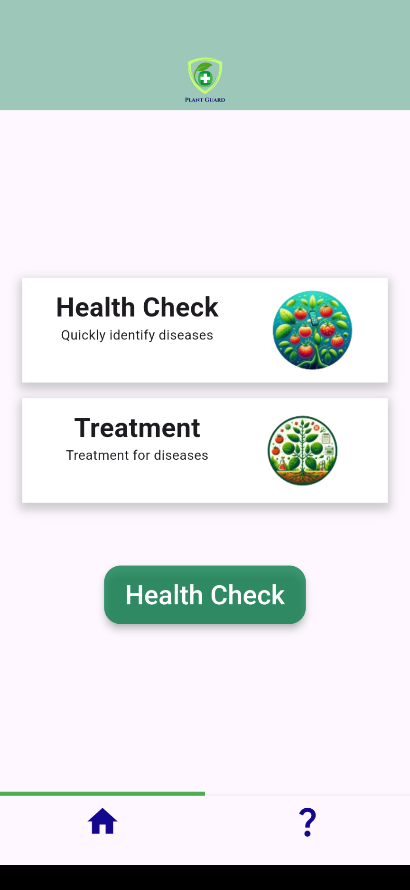
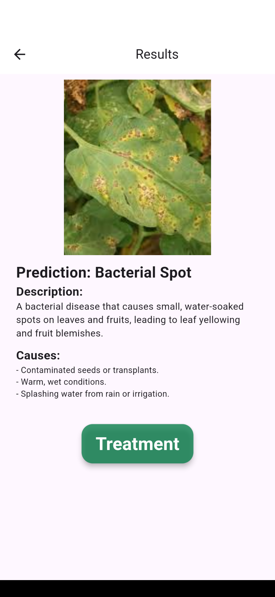
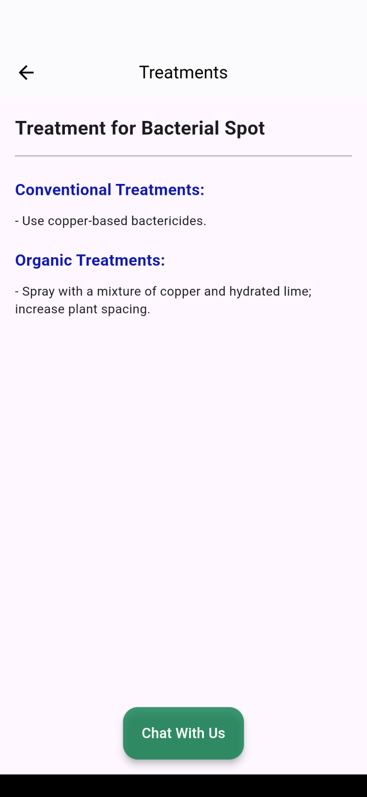
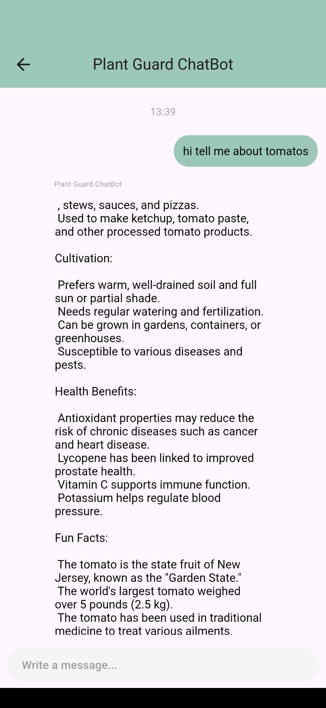

# 🍅 Plant Guard – Tomato Disease Detection App

### 🌿 Overview
**Plant Guard** is an AI-powered mobile application built using **Flutter** to help farmers and gardeners identify **tomato leaf diseases** instantly.  
Users can capture a tomato leaf photo, and the app predicts the disease using a **TensorFlow Lite model** trained with **MobileNetV2**.  
It also provides both **organic** and **conventional treatments**, plus a **ChatGPT-powered chatbot** for tomato-related advice.

---

## 📱 App Features

- 📷 **Disease Detection** – Capture or upload tomato leaf images and get instant predictions.  
- 🧠 **AI Model** – Uses a custom-trained **MobileNetV2 (TFLite)** model optimized for mobile performance.  
- 💊 **Treatment Suggestions** – Recommends **organic** and **conventional** treatments for each detected disease.  
- 💬 **ChatBot (GPT)** – Users can chat with an AI assistant to learn about tomato cultivation and diseases.  
- 🌾 **Educational Info** – Offers fun facts, cultivation tips, and health benefits of tomatoes.

---

## 🧬 Diseases Detected

1. Bacterial Spot  
2. Early Blight  
3. Late Blight  
4. Leaf Mold  
5. Septoria Leaf Spot  
6. Spider Mites (Two-Spotted)  
7. Target Spot  
8. Yellow Leaf Curl Virus  
9. Healthy Leaf Detection  

---

## 🧠 Model Details

- **Architecture:** MobileNetV2  
- **Framework:** TensorFlow 2.x  
- **Training Platform:** Google Colab  
- **Epochs:** 50  
- **Output Model:** `tomato_disease_model.tflite`

Notebook used: [`MobileNetv2Epoch50.ipynb`](tomato.pdf)

---

## 🏗️ Tech Stack

| Layer | Technology |
|-------|-------------|
| **Frontend** | Flutter |
| **AI Model** | TensorFlow / TFLite |
| **Model Training** | Google Colab |
| **Backend AI Chat** | OpenAI ChatGPT API |
| **IDE** | Android Studio / VS Code |

---

## 🖼️ App Screenshots

| Home Page | Capture Photo | Result & Treatment | Chat Interface |
|------------|---------------|--------------------|----------------|
|  |  |  |  |


---

## ⚙️ Installation Guide

1. **Clone the repository**
   ```bash
   git clone https://github.com/<your-username>/PlantGuard.git
   cd PlantGuard
   ```

2. **Install dependencies**
   ```bash
   flutter pub get
   ```

3. **Add your OpenAI API key**
   - Locate the configuration file (e.g., `config.dart` or `.env`).
   - Insert your API key for ChatGPT integration.

4. **Run the app**
   ```bash
   flutter run
   ```

---


## 💡 Future Enhancements

- 🌱 Real-time detection via camera stream  
- 🌍 Multilingual support for farmers  
- ☁️ Cloud-based data logging and analytics  
- 📊 Graphical disease trend visualization  

---

## 🙏 Acknowledgments

- **Dataset:** PlantVillage / Kaggle Tomato Dataset  
- **Frameworks:** TensorFlow, Flutter  
- **AI Support:** OpenAI GPT API  
- **Inspiration:** To assist farmers with AI-based disease detection

---

## 📜 License

This project is released under the **MIT License**.  
You are free to use, modify, and distribute with appropriate credit.

---

### 👨‍💻 Developer

**Developed by:** Priyanjan perera  
**GitHub:**   https://github.com/priyanjanjb
**Email:** priyanjanjb@gmail.com
